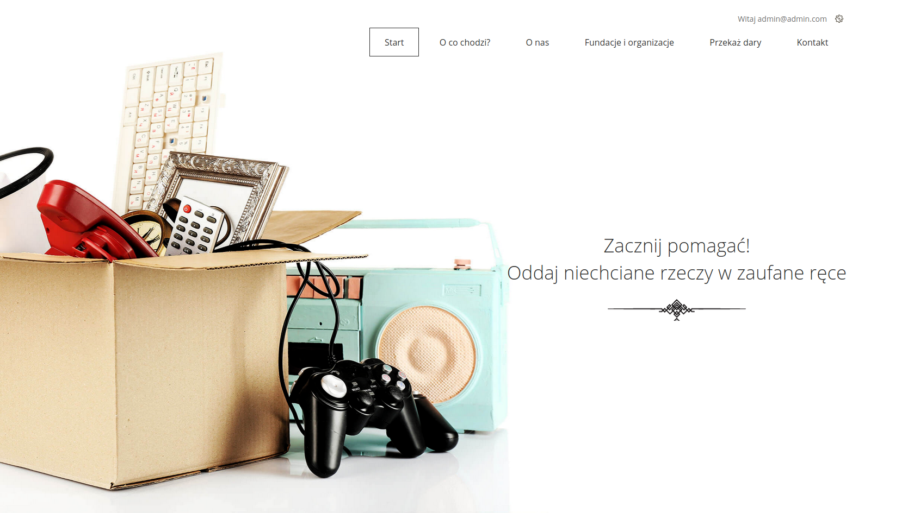
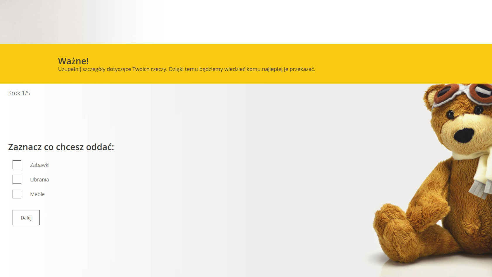
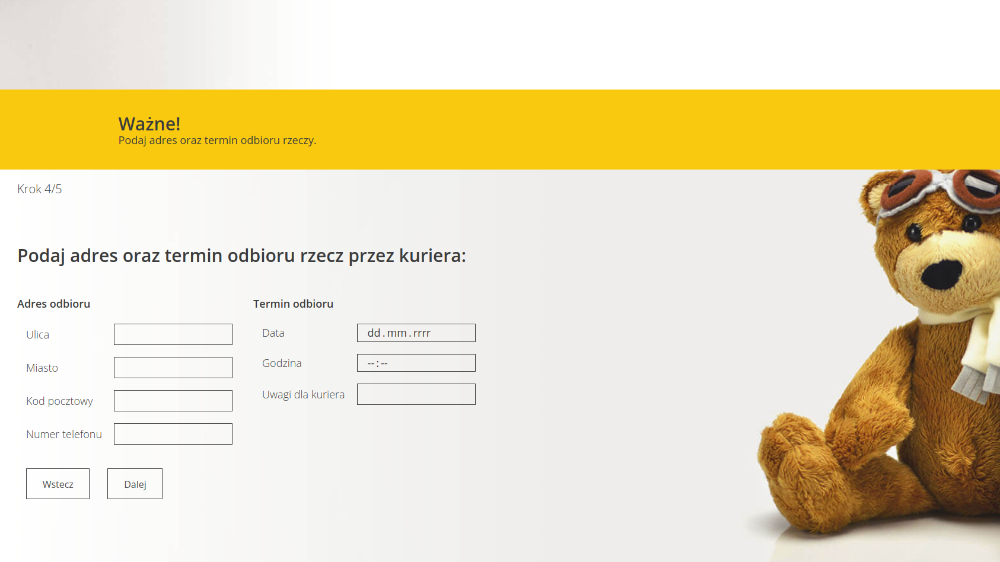

# GOOD HANDS

A simple django application that solves the problem of giving away useless things (clothes, furniture, electronics, ect
...) to the charity institutions. It connects the donor with the charity and makes a life easier.

## Visuals

#### Landing page

In the top-right corner is link to user profile and logout. "Przekaż dary" is a making donation form. Rest of the links 
is base extendet information (same as before login).

#### Form


Form is using JavaScript to avoid reloading a page till it's done. Form have 5 steps. JS is also used for dynamic 
sorting a data, for example: what institution you will see it depends which category you choose before. After filling 
the form, summary displays and submit button.

## Installation

Use the package manager pip to install requirements.txt.

```bash
pip install requrements.txt
```

**:exclamation: CREATE SUPERUSER :exclamation:**

## Usage

To run a project, first you have to make changes in settings. You can do thins in several ways:
1. Use python_decouple module (safer)
2. Fill up a settings in settings.py (non-confidential data)

- For first method install module.

```bash
pip install python-decouple
```
Then check in your settings.py if you have imported module.

```python
from decouple import config
```
Next in the project you will find `.env.example` file. Rename it to `.env` and fill your data in it.

- For the second method in settings.py replaced
```python
SECRET_KEY = config('SECRET_KEY')
```
to
```python
SECRET_KEY = '#nj&njyte......................'
```
and do this to every changed setting.

It may happend that you will have to add manually from shell or from django admin site some data. Also as superuser you 
will have and extra field to enter to admin.


## Support

If you need any help:

:email: **Email** - *aaa@aaa.com*

:telephone_receiver: **Phone** - *123456789*

## Project status

Project is still in development. Many things will be added soon:
- [ ] Add localization form mobile version
- [ ] Make separate system for provider
- [ ] Add a statistic for regions, people...
- [ ] Add message system (donor - courier)
